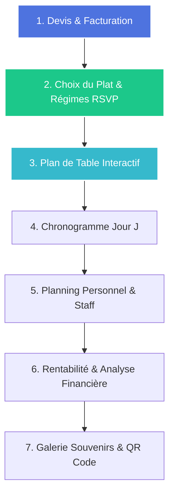

# EventManager - Roadmap Évolutive (Roadmap & Spécifications)

Ce document présente la feuille de route stratégique pour les prochaines étapes de développement d'**EventManager**. Les fonctionnalités sont classées dans l'ordre séquentiel d'importance (du plus critique au moins prioritaire), en se basant sur le cycle de vie complet d'une prestation événementielle (devis -> planification -> invitations -> jour J -> clôture financière).

---

## 🗺️ Résumé de la Séquence des Développements

---

## 1. Devis, Facturation et Suivi des Règlements (Phase de Réservation)
> **Priorité :** 🔴 **Critique (Indispensable pour un modèle SaaS Traiteur)**  
> **Objectif :** Permettre au traiteur de transformer un projet d'événement en proposition commerciale formelle, d'éditer des factures d'acompte et de solde, et de suivre les paiements.

### 🎨 Design & UX (OneUI 5.12)
* **Dans les Détails de l'Événement :** Ajout d'un onglet **"Finances & Devis"**.
* **Éditeur de Devis :** Interface interactive avec les composants de menu déjà configurés. Le traiteur peut ajouter des lignes de service personnalisées (ex: "Location de vaisselle", "Frais de livraison", "Droit de bouchon").
* **Statuts Visuels :** Badges colorés OneUI pour l'état du devis (`Brouillon`, `Envoyé`, `Accepté`, `Refusé`, `Facturé`).
* **Portail Client (Public) :** Page sécurisée sans authentification (similaire à l'RSVP) où le client final peut visualiser la proposition commerciale, télécharger le PDF et cliquer sur un bouton **"Accepter & Signer le devis"**.

### ⚙️ Backend & Architecture (Spring Boot)
* **Entités :** `QuoteEntity`, `QuoteItemEntity`, `InvoiceEntity`, `PaymentEntity`.
* **Règles métier :** Calcul automatique de la TVA, génération de la référence de devis/facture unique, gestion des acomptes (ex: 30% à la signature, 70% le Jour J).
* **Hexagone :** Nouveaux ports d'exportation pour le stockage/génération de PDF de facture normalisés.

---

## 2. Choix du Plat & Régimes Alimentaires Invités (Phase d'Invitation/RSVP)
> **Priorité :** 🟠 **Élevée (Lien direct entre Invités et Restauration)**  
> **Objectif :** Connecter la gestion des invités à la cuisine. Lors de sa réponse, l'invité choisit sa formule de repas (si Plat Fixe) et indique ses allergies.

### 🎨 Design & UX (OneUI 5.12)
* **Portail RSVP Invité (`/rsvp/:id`) :** Si l'invité clique sur *"Je serai présent"*, un volet dynamique s'ouvre :
  * Un sélecteur d'options pour le plat principal (ex: *Filet de bœuf* vs *Dos de cabillaud* vs *Risotto végétarien*).
  * Des cases à cocher pour les allergènes majeurs (Gluten, Lactose, Arachides) et régimes particuliers (Halal, Casher, Végan).
* **Tableau de Bord Cuisine (Côté Traiteur) :** Dans l'onglet **"Menu"** ou **"Invités"**, un widget récapitulatif affiche les statistiques en temps réel pour le chef cuisinier (ex: "45 Bœuf, 12 Poisson, 3 sans Gluten").

### ⚙️ Backend & Architecture (Spring Boot)
* **Entités :** Modification de `GuestEntity` pour ajouter `selectedMealId` (clé étrangère optionnelle vers `MenuItemEntity`) et un ensemble de tags d'allergies/régimes.
* **API :** Endpoint d'agrégation `/api/events/{id}/catering-summary` retournant le décompte exact des plats et des allergies pour l'équipe de production.

---

## 3. Plan de Table et Placement Interactif (Phase logistique)
> **Priorité :** 🟡 **Moyenne-Élevée (Forte valeur ajoutée pour les mariages)**  
> **Objectif :** Offrir un outil visuel simple pour structurer la salle de réception, créer des tables (rondes, rectangulaires) et y assigner les invités confirmés.

### 🎨 Design & UX (OneUI 5.12)
* **Interface Plan de Table :** Vue en grille ou canvas interactif.
* **Gestion des Tables :** Boutons rapides pour "Ajouter une Table" (définir la forme, la capacité ex: 8 personnes, le nom ex: "Table d'honneur").
* **Glisser-Déposer (Drag & Drop) :** Liste latérale des invités confirmés non placés. L'utilisateur les glisse sur les chaises vides de la table.
* **Alertes de Cohérence :** Indicateur visuel si une table dépasse sa capacité ou si des invités ayant des affinités (ou du même groupe familial) sont séparés.

### ⚙️ Backend & Architecture (Spring Boot)
* **Entités :** `ReceptionTableEntity` (ID, nom/numéro, forme, capacité, coordonnées X/Y de placement dans la salle, relation OneToMany avec `GuestEntity`).
* **API :** Mettre à jour `GuestEntity` pour y lier un `table_id`. Permettre la mise à jour par lot (batch update) lors du réarrangement des tables.

---

## 4. Chronogramme & Déroulé du Jour J (Phase de Coordination)
> **Priorité :** 🟢 **Moyenne (Essentiel pour la logistique terrain)**  
> **Objectif :** Remplacer le tableur Excel du déroulé de la journée par un rétroplanning heure par heure partagé avec l'équipe de service et le client.

### 🎨 Design & UX (OneUI 5.12)
* **Interface Timeline :** Composant chronologique vertical (OneUI Timeline) avec heures exactes (ex: *14:00 - Arrivée des mariés*, *18:30 - Début du cocktail*, *20:30 - Lancement du plat chaud*).
* **Assignation d'Équipe :** Indiquer pour chaque étape qui est le responsable (ex: "Équipe Cuisine", "Maître d'hôtel", "DJ").
* **Mode Sombre / Mobile :** Un affichage optimisé sur smartphone pour que les serveurs en salle puissent consulter le planning en temps réel pendant le rush.

### ⚙️ Backend & Architecture (Spring Boot)
* **Entités :** `TimelineItemEntity` (ID, time, title, description, responsibleParty, status, eventId).
* **API :** CRUD complet avec tri automatique par heure et passerelle de notification ou de statut (ex: étape "Terminée" en direct).

---

## 5. Gestion du Personnel et Plannings de Service (Phase opérationnelle)
> **Priorité :** 🟢 **Moyenne-Basse (Optimisation interne traiteur)**  
> **Objectif :** Organiser les équipes de serveurs, cuisiniers et extras requis pour assurer la prestation, avec suivi des heures et coûts associés.

### 🎨 Design & UX (OneUI 5.12)
* **Dashboard Staff :** Tableau de répartition des effectifs par rôle (Chef de cuisine, Maître d'hôtel, Serveur, Commis).
* **Gestion du Planning :** Saisie des heures d'embauche et de fin pour chaque équipier.
* **Calculateur de Coût de Personnel :** Intégration du coût horaire ou forfaitaire direct de chaque membre du staff pour l'intégrer aux dépenses de l'événement.

### ⚙️ Backend & Architecture (Spring Boot)
* **Entités :** `StaffMemberEntity`, `ShiftAssignmentEntity` (contient le taux horaire, les heures planifiées, le statut de présence).
* **Securité :** Possibilité d'étendre les rôles utilisateurs pour permettre aux "Staff" de se connecter et voir uniquement leur feuille de route (sans voir les finances globales).

---

## 6. Analyse de Rentabilité et Tableau de Bord Financier (Phase de Clôture)
> **Priorité :** 🟢 **Moyenne-Basse (Pilotage d'entreprise)**  
> **Objectif :** Offrir au traiteur une vue consolidée de ses marges financières par événement.

### 🎨 Design & UX (OneUI 5.12)
* **Dashboard Financier :** Onglet graphique (utilisant Chart.js intégré dans OneUI) comparant :
  * **Chiffre d'Affaires Généré** (factures clients).
  * **Coûts de Production** (matières premières des menus + coûts du personnel de service + locations externes).
  * **Marge Nette & Pourcentage de Profit**.
* **Comparaison Inter-événements :** Graphique annuel des mois les plus rentables.

### ⚙️ Backend & Architecture (Spring Boot)
* **Calculs consolidés :** Services backend réalisant des agrégations SQL complexes pour comptabiliser les recettes et dépenses rattachées à un événement, évitant de charger toutes les données brutes sur le client.

---

## 7. Galerie de Souvenirs & Mur de Photos Partagé (Phase Post-Événement)
> **Priorité :** ⚪ **Basse (Bonus Expérience & Viralité)**  
> **Objectif :** Proposer une valeur ajoutée unique après l'événement en permettant aux invités de téléverser et visionner les photos de la soirée via un simple QR Code.

### 🎨 Design & UX (OneUI 5.12)
* **Générateur de QR Code :** Affiché dans l'espace traiteur pour être imprimé sur des chevalets de table ("Partagez vos photos ici !").
* **Galerie Mobile :** Interface simplifiée sur smartphone pour prendre une photo en direct ou en sélectionner dans la pellicule, avec téléversement immédiat.
* **Modération :** Le traiteur et les mariés ont un écran de contrôle pour masquer ou supprimer les clichés inappropriés.

### ⚙️ Backend & Architecture (Spring Boot)
* **Stockage :** Intégration d'un port de stockage de fichiers (ex: AWS S3, Cloudinary ou stockage local sécurisé).
* **Entités :** `EventMediaEntity` (ID, fileUrl, uploadedBy, timestamp, isApproved).
