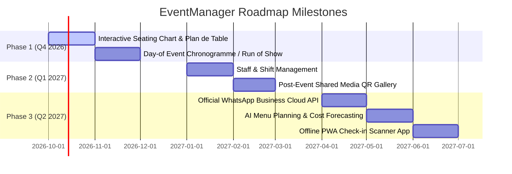

# EventManager - Strategic Product Roadmap

**EventManager** is an all-in-one SaaS platform engineered for professional caterers, event organizers, and wedding planners. It streamlines the full lifecycle of high-end events: commercial quoting, interactive luxury digital invitations, culinary menu planning, token-based guest RSVP tracking, collaborative client portals, and financial profitability analysis.

---

## 🏛️ System Architecture & Technology Stack

```mermaid
graph LR
    subgraph Frontend ["Frontend (Angular 17+ Standalone & Signals)"]
        A1[Caterer Admin Studio]
        A2[Client Collaboration Portal]
        A3[Public Luxury RSVP Experience]
        A4[SuperAdmin SaaS Console]
    end

    subgraph Backend ["Backend (Spring Boot 3 - Hexagonal Architecture)"]
        B1[Presentation / REST API]
        B2[Application Services & UseCases]
        B3[Domain Models & Business Rules]
        B4[Infrastructure / JPA / Flyway / Stripe]
    end

    subgraph Storage ["Persistence & External Services"]
        C1[(PostgreSQL / MySQL)]
        C2[Stripe Subscription Webhooks]
        C3[Google Fonts & Maps API]
    end

    Frontend --> Backend
    Backend --> Storage
```

---

## ✅ Completed Features (DONE)

### 1. Multi-Tenant Architecture, Security & Authentication
- [x] **Multi-Tenancy Isolation:** Strict tenant separation by Caterer Organization across all data layers, preventing cross-tenant leakage.
- [x] **Role-Based Access Control (RBAC):** Distinct roles for `SUPER_ADMIN`, `CATERER_ADMIN`, `STAFF`, and `CLIENT`.
- [x] **JWT & Security Pipeline:** Stateless JWT authentication with refresh flows, password encryption (BCrypt), and automated security filters.
- [x] **Client Token Authentication:** Secure magic-link and direct portal authentication for end-clients without requiring complex registrations.
- [x] **Subscription Guarding:** Active subscription validation middleware blocking expired caterer accounts with graceful renewal prompts.

### 2. Digital Luxury Invitation Studio & Template Engine
- [x] **Admin Template Catalog:** Full CRUD management for reusable invitation templates categorized by event types (*Mariage, Fiançailles, Corporate, Anniversaire, Gala*).
- [x] **Dynamic Luxury Styling:** Real-time customization of primary/secondary colors, background palettes, and Google Fonts dynamic loader (*Cinzel, Great Vibes, Playfair Display, Montserrat, Alex Brush, etc.*).
- [x] **Ambient Visual Particle Engine:** 5 customizable atmospheric effects (*Gold Dust, Rose Petals, Festive Confetti, Sparkle Stars, Spotlight Beam*).
- [x] **Device-Adaptive Particle Framing:**
  - *Mobile (`< 992px`):* Particles strictly framed to left/right lateral margins ($\le 16\%$ and $\ge 84\%$) to protect central text readability.
  - *Desktop (`\ge 992px`):* Particles dynamically dispersed across the full background canvas ($3\% - 97\%$).
- [x] **Interactive Opening Experiences:** 5 prestigious animation styles (*Royal Wax Envelope, Silk Ribbon Cut, Theater Curtain Unveil, Sliding Luxury Doors, VIP Hologram Badge*).
- [x] **Interactive Audio Player:** Ambient background music integration with rotating vinyl disc animation, equalizer soundwave bars, and auto-play on user interaction.
- [x] **Instant Template Hydration:** Local & `sessionStorage` caching mechanism ensuring 0ms instant preview and zero-flicker reload on F5.

### 3. Public Guest RSVP Portal (`/rsvp/:id`)
- [x] **Token-Based Guest Access:** Unique encrypted guest URLs allowing zero-friction RSVP without login.
- [x] **Multi-Course Gastronomy Selection:**
  - *Fixed Plated Menu:* Step-by-step interactive dish selection (*Entrées, Plats Principaux, Desserts, Boissons*) with high-res dish photos and gourmet descriptions.
  - *Buffet Menu:* Complete buffet catalogue browsing with category badges (*Salé, Chaud, Douceurs, Boissons*).
  - *Mixed Formula (`MIX`):* Plated main dishes paired with buffet starters & dessert bars.
- [x] **Dietary & Allergy Tracking:** Multi-select allergen tags (Gluten, Lactose, Nuts, etc.) and dietary specifications (Halal, Kosher, Vegan, Vegetarian).
- [x] **Plus-One & Companion Management:** Dynamic registration of additional family members and companions.
- [x] **Decline Flow with Host Messages:** Graceful decline workflow with personalized blessing/regret messages sent directly to the organizers.
- [x] **Calendar & Navigation Integration:** One-click Google Calendar / `.ics` export and Google Maps GPS navigation to venue and designated parking areas.

### 4. End-Client Portal (Collaborative Experience)
- [x] **Client Dashboard:** Real-time overview of event status, total invited vs confirmed guests, countdown timer, and caterer contact card.
- [x] **Live Guest List Management:** Clients can add, edit, search, and group their guests (*Famille Proche, Amis, VIP, Collègues*).
- [x] **Culinary Preferences Overview:** Real-time dish selection tallies and dietary breakdown accessible by the client.
- [x] **Live Invitation Preview:** Embedded interactive preview reflecting real-time changes to invitation text, venue details, and schedule.

### 5. Menu & Culinary Catering Engine
- [x] **Dish Catalog Management:** Full inventory of appetizers, entrées, mains, desserts, and drinks with pricing, descriptions, and dietary flags.
- [x] **Dish Image Asset Manager:** Multipart image upload with thumbnail generation and CDN/local asset serving.
- [x] **Kitchen Production Summary:** Aggregated meal counts per dish and allergen alerts for kitchen executive chefs.

### 6. Financial Management, Billing & Expenses
- [x] **Client Payment Tracking:** Deposit scheduling (Acomptes), settlement logging, remaining balance computation, and payment status badges.
- [x] **Event Expense Management:** Categorized tracking of event-related costs (Ingredients, Staff, Equipment rental, Venue, Logistics).
- [x] **Net Profit KPI Calculations:** Real-time calculation of gross revenue, total operational expenses, and net profit margins per event.
- [x] **Printable Vouchers & PDF Receipts:** Instant generation and OS printing of official Client Payment Receipts and Internal Expense Vouchers.

### 7. Multi-Channel Invitation Dispatch & Data Import/Export
- [x] **Multi-Channel Dispatcher:** One-click invitation dispatch via WhatsApp Web API, direct Email, and SMS format generator.
- [x] **Server-Side Excel (.xlsx) & CSV Import:** Robust spreadsheet importer with automatic separator detection and scoped dynamic group validation.
- [x] **Data Export Pipeline:** One-click export of guest lists, dietary sheets, and financial records to Excel (.xlsx) and CSV.

### 8. Internationalization & Multi-Currency Engine
- [x] **Multi-Language (i18n):** Complete localized interface in French (`fr`), English (`en`), and Arabic (`ar`).
- [x] **Multi-Currency Engine:** Configurable currency display across Moroccan Dirham (`MAD`), Euro (`EUR`), US Dollar (`USD`), British Pound (`GBP`), and Canadian Dollar (`CAD`).

### 9. SaaS Subscription & Monetization
- [x] **Tiered Pricing Plans:** Starter, Professional, and Enterprise subscription tiers.
- [x] **Stripe Checkout & Webhooks:** Automated customer billing, recurring subscriptions, and payment status webhooks.

---

## 🚀 Future Roadmap & Planned Features (TO DO)

### 🪑 Priority 1: Interactive Seating Chart & Plan de Table (In Pipeline)
> **Target:** Q4 2026 | **Priority:** 🔴 Critical
- [ ] **Interactive Canvas Floorplan:** Visual drag-and-drop floor plan designer to position round, rectangular, oval, and serpentine tables.
- [ ] **Guest Seat Assignment:** Drag confirmed guests from an unassigned sidebar directly to designated chairs.
- [ ] **Constraint & Affinity Warnings:** Smart alerts when tables exceed maximum capacity or when conflicting guest groups are seated adjacently.
- [ ] **Table Card & Seating Plan PDF Export:** Printable high-resolution table placemats and master seating charts for reception hosts.

### ⏱️ Priority 2: Day-of Event Chronogramme & Live Run-of-Show
> **Target:** Q4 2026 | **Priority:** 🟠 High
- [ ] **Minute-by-Minute Timeline:** Step-by-step master schedule (*e.g., 17:30 Arrival, 18:45 Cocktail Reception, 20:30 First Course Service, 23:00 Cake Cutting*).
- [ ] **Department Tagging:** Assign specific schedule items to responsible teams (*Cuisine, Salle / Maître d'Hôtel, DJ / Animation, Photographe*).
- [ ] **Mobile Live Mode:** Lightweight real-time view for service staff on smartphones with milestone checkoffs.

### 👥 Priority 3: Staffing, Extras & Shift Management
> **Target:** Q1 2027 | **Priority:** 🟡 Medium-High
- [ ] **Staff Roster & Roles:** Manage permanent personnel and temporary extra workers (*Serveurs, Cuisiniers, Plongeurs, Barmen, Régisseurs*).
- [ ] **Shift Scheduling & Cost Allocation:** Track check-in/check-out hours, compute hourly wages, and automatically inject staffing costs into the event expense ledger.
- [ ] **Staff Portal / SMS Briefing:** Send automated shift details and dress code briefings to scheduled staff members.

### 📸 Priority 4: Shared Post-Event Media Gallery & QR Code Wall
> **Target:** Q1 2027 | **Priority:** 🟢 Medium
- [ ] **Tabletop QR Code Generator:** Pre-designed table card templates inviting guests to scan and upload their event photos.
- [ ] **Guest Photo Upload Stream:** Fast mobile upload without app download, allowing guests to share live memories.
- [ ] **Host Moderation Dashboard:** Approval queue for the event organizer to filter and moderate photos before public slideshow display.
- [ ] **High-Resolution Zip Download:** One-click bulk download of all captured photos for the bride & groom / corporate client.

### 📲 Priority 5: WhatsApp Cloud API & Automated SMS Gateway
> **Target:** Q2 2027 | **Priority:** 🟢 Medium
- [ ] **Official Meta WhatsApp Cloud API Integration:** Automated bulk WhatsApp invitation delivery with verified business templates.
- [ ] **Automated RSVP Reminders:** Scheduled reminder messages to non-responding guests 7 days and 48 hours before RSVP closing date.
- [ ] **Interactive WhatsApp Buttons:** Guests can reply "Confirm" or "Decline" directly within WhatsApp chat.

### 🤖 Priority 6: AI-Powered Catering Assistant & Menu Cost Optimization
> **Target:** Q2 2027 | **Priority:** 🔵 Innovation
- [ ] **Smart Menu Generator:** AI-assisted banquet suggestions based on budget per head, season, theme, and dietary restrictions.
- [ ] **Automated Recipe Ingredient Scaling:** Compute exact raw ingredient quantities required based on confirmed RSVP guest choices.
- [ ] **Predictive Wastage Analysis:** Historical analysis to recommend optimal buffet portion margins and minimize food waste.

### 📱 Priority 7: Offline-First PWA & Door Check-In QR Scanner
> **Target:** Q2 2027 | **Priority:** ⚪ Enhancements
- [ ] **PWA Door Attendant App:** Fast offline-capable mobile app to scan guest QR codes at venue entrance gates.
- [ ] **Real-Time Attendance Sync:** Instant attendance synchronization across multiple tablet scanners at different entry doors.
